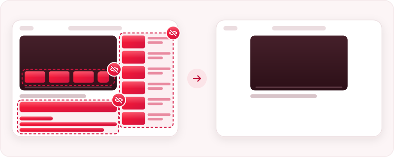
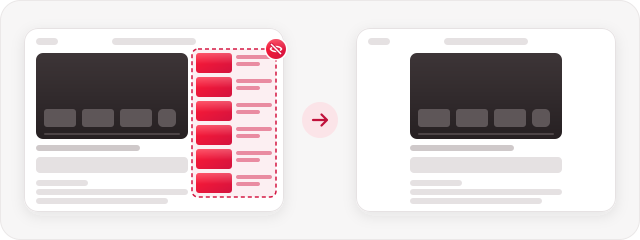
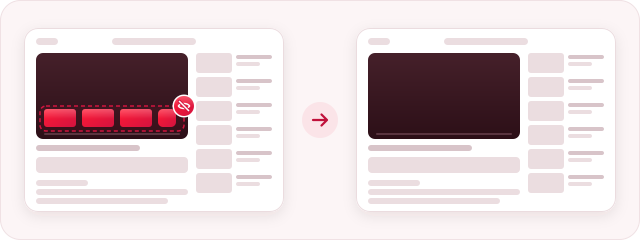
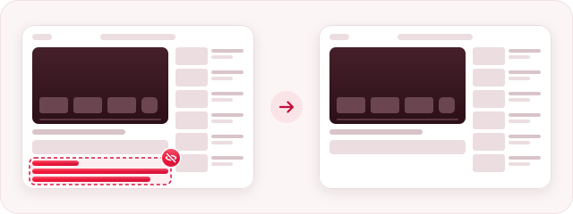
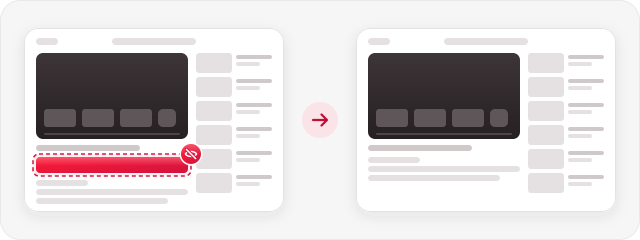
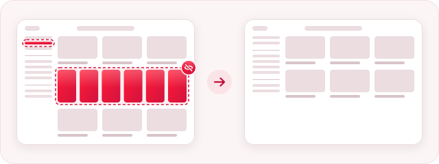
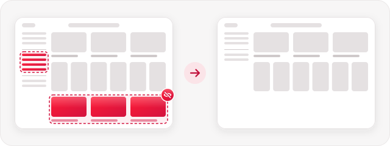
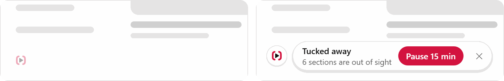
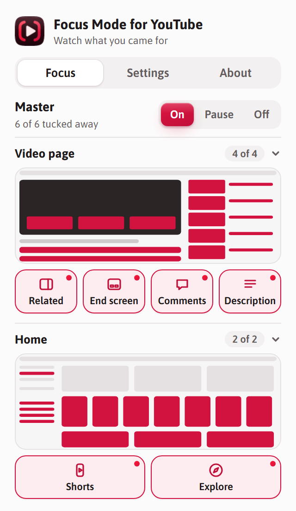
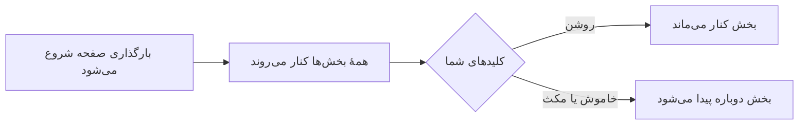

<div dir="rtl">

<p align="center">
  <a href="README.md">English</a> · <b>فارسی</b>
</p>

<p align="center">
  
</p>

<h1 align="center">Focus Mode for YouTube</h1>

<p align="center">
  هر چیزی را که حواستان را از ویدیوی دلخواهتان پرت می‌کند، کنار می‌گذارد.<br>
  <sub>رایگان · متن‌باز · بدون ردیابی · بدون وابستگی به YouTube</sub>
</p>

<p align="center">
  <a href="https://github.com/aenimaa/focus-mode-for-youtube/releases/latest/download/focus-mode-for-youtube.zip"><b>⬇️ دریافت آخرین نسخه</b></a><br>
  <sub>برای Chrome و دیگر مرورگرهای Chromium · <a href="https://aenimaa.github.io/focus-mode-for-youtube/">وب‌سایت</a></sub><br>
  <a href="https://addons.mozilla.org/firefox/addon/focus-mode-for-youtube/"></a>
</p>

<p align="center">
  <picture>
    <source media="(prefers-color-scheme: dark)" srcset="docs/illustrations/hero-dark.svg">
    
  </picture>
</p>

---

## 🚀 نصب در یک دقیقه

🦊 **از Firefox استفاده می‌کنید؟** آن را با یک کلیک [از Firefox Add-ons نصب کنید](https://addons.mozilla.org/firefox/addon/focus-mode-for-youtube/)؛ خودش به‌روز می‌شود. مراحل زیر برای Chrome و دیگر مرورگرهای Chromium است.

**۱.** فایل دانلودشده را **از حالت فشرده خارج کنید**.

**۲.** صفحهٔ `chrome://extensions` را باز کنید و در بالای صفحه **Developer mode (حالت توسعه‌دهنده)** را روشن کنید.

**۳.** روی **Load unpacked (بارگذاری پوشهٔ بازشده)** بزنید و پوشه‌ای را که از فایل فشرده بیرون آمده انتخاب کنید.

📌 بعد روی نماد تکهٔ پازل در نوار ابزار Chrome بزنید و **Focus Mode for YouTube** را سنجاق کنید تا همیشه دم دستتان باشد.

## 🙈 چه چیزهایی را کنار می‌گذارد

هر بخش کلید خودش را دارد. در ابتدا همه کنار رفته‌اند و هر کدام را که دلتان برایش تنگ شد، می‌توانید برگردانید.

### در صفحهٔ ویدیو

#### ویدیوهای مرتبط

ستون ویدیوهای پیشنهادی کنار پخش‌کننده. ویدیو به وسط صفحه می‌آید؛ فهرست‌های پخش، گفتگوی زنده و رونوشت ویدیو سر جایشان می‌مانند.

<picture>
  <source media="(prefers-color-scheme: dark)" srcset="docs/illustrations/related-dark.svg">
  
</picture>

#### صفحهٔ پایانی

کارت‌ها و شبکهٔ ویدیوهای پیشنهادی که در پایان ویدیو ظاهر می‌شوند. شمارش معکوس پخش خودکار همچنان دیده می‌شود.

<picture>
  <source media="(prefers-color-scheme: dark)" srcset="docs/illustrations/endscreen-dark.svg">
  
</picture>

#### نظرها

نظرهای زیر ویدیو.

<picture>
  <source media="(prefers-color-scheme: dark)" srcset="docs/illustrations/comments-dark.svg">
  
</picture>

#### توضیحات

کادر زیر عنوان، با تعداد بازدید، تاریخ و توضیحات ویدیو.

<picture>
  <source media="(prefers-color-scheme: dark)" srcset="docs/illustrations/description-dark.svg">
  
</picture>

### در صفحهٔ اصلی (Home)

#### Shorts

ردیف‌های Shorts، تک‌ویدیوهای Shorts در نتایج جست‌وجو و زیر ویدیوها، و گزینهٔ Shorts در منو.

<picture>
  <source media="(prefers-color-scheme: dark)" srcset="docs/illustrations/shorts-dark.svg">
  
</picture>

#### کاوش (Explore)

بخش کاوش در منوی کناری، و ردیف «Explore more topics» (کاوش در موضوع‌های بیشتر) در صفحهٔ اصلی.

<picture>
  <source media="(prefers-color-scheme: dark)" srcset="docs/illustrations/explore-dark.svg">
  
</picture>

## 🎛️ کنترل‌ها

**⏸️ هر وقت YouTube مثل همیشه را خواستید، مکث کنید.** کلید اصلی (Master) سه حالت دارد: On (روشن)، Pause (مکث) و Off (خاموش). می‌توانید برای ۱۵ دقیقه، یک ساعت یا تا فردا صبح مکث کنید؛ بعد خودش دوباره روشن می‌شود.

**🫧 نشان آرامِ گوشه.** نشان کوچکی در گوشهٔ پایین سمت چپ YouTube می‌گوید چه چیزهایی کنار رفته‌اند و دکمه‌ای هم برای ۱۵ دقیقه مکث دارد. تا موس را رویش نبرید کم‌رنگ می‌ماند و روزی فقط یک بار خودش را نشان می‌دهد. با ✕ آن را می‌بندید و چند ثانیه فرصت دارید تا **Undo (برگرداندن)** را بزنید. از پنجرهٔ افزونه هم می‌شود آن را خاموش کرد.

<p align="center">
  <picture>
    <source media="(prefers-color-scheme: dark)" srcset="docs/screenshots/badge-dark.png">
    
  </picture>
</p>

**🗺️ پنجره‌ای با نقشه.** پنجرهٔ افزونه سه زبانه دارد:

- **Focus (تمرکز):** نقشهٔ کوچکی از صفحهٔ ویدیو و صفحهٔ اصلی. روی یک کاشی، یا خودِ آن بخش روی نقشه، بزنید تا کنار برود یا برگردد.
- **Settings (تنظیمات):** ظاهر پنجره (روشن، تیره یا مطابق سیستم) و نشان گوشه.
- **About (درباره):** این‌که چطور امن می‌ماند، و جایی برای گزارش مشکل.

<p align="center">
  <picture>
    <source media="(prefers-color-scheme: dark)" srcset="docs/screenshots/popup-dark.png">
    
  </picture>
</p>

## 🔒 امن از پایه

فقط روی youtube.com کار می‌کند و تنها اجازه‌اش ذخیرهٔ تنظیمات خودش است. هیچ درخواستی به شبکه نمی‌فرستد، ردیابی نمی‌کند و چیزی جمع نمی‌کند.
[خودتان بررسی کنید (به انگلیسی) ←](SAFETY.md) · [بررسی‌کنندهٔ ایمنی آنلاین ←](https://aenimaa.github.io/focus-mode-for-youtube/tools/safety-check.html)

[ببینید هر نوع افزونه چه‌قدر دسترسی لازم دارد ←](SAFETY.md#how-much-access-does-an-extension-need)

## 🙋 چیزی درست کار نمی‌کند؟ ایده‌ای دارید؟

YouTube صفحه‌اش را زیاد تغییر می‌دهد؛ برای همین گزارش‌های شما این افزونه را سرپا نگه می‌دارد.

🐞 **[گزارش مشکل](https://github.com/aenimaa/focus-mode-for-youtube/issues/new?template=bug_report.yml)** &nbsp;·&nbsp; 💡 **[پیشنهاد قابلیت](https://github.com/aenimaa/focus-mode-for-youtube/issues/new?template=feature_request.yml)**

---

## 📚 بیشتر

👇 *روی هر موضوع بزنید تا باز شود.*

<details>
<summary><b>🔄 به‌روزرسانی به نسخهٔ جدید</b></summary>
<br>

فایل zip جدید را دانلود کنید، آن را روی پوشهٔ قبلی باز کنید و در `chrome://extensions` روی **Reload (بارگذاری دوباره)** در کارت افزونه بزنید. تنظیماتتان سر جایش می‌ماند، حتی اگر پوشه را جابه‌جا کنید یا نامش را عوض کنید.

</details>

<details>
<summary><b>🌐 مرورگرهای دیگر</b></summary>
<br>

🦊 **Firefox نسخهٔ ۱۴۰ به بعد:** آن را از [Firefox Add-ons](https://addons.mozilla.org/firefox/addon/focus-mode-for-youtube/) نصب کنید. خودش به‌روز می‌شود.

در Chrome نسخهٔ ۱۰۷ به بعد و دیگر مرورگرهای Chromium کار می‌کند: Edge، Brave، Opera و Vivaldi. صفحهٔ افزونه‌های این مرورگرها هم همان گزینه‌های **Developer mode** و **Load unpacked** را دارد.

</details>

<details>
<summary><b>⚙️ چطور کار می‌کند</b></summary>
<br>

قاعده‌های پنهان‌سازی CSS ساده‌اند و پیش از آن‌که YouTube صفحه را نمایش دهد اعمال می‌شوند؛ پس چیزی حتی لحظه‌ای روی صفحه نمی‌آید. تغییرات بی‌درنگ به همهٔ زبانه‌های باز YouTube می‌رسد. اگر همگام‌سازی Chrome یا Firefox Sync روشن باشد، انتخاب‌هایتان روی رایانه‌های دیگرتان هم با شما می‌آید.

<div dir="ltr">



```
extension/           خودِ افزونه؛ همان چیزی که دانلود می‌کنید
  hide.css           قاعده‌هایی که هر بخش را کنار می‌گذارند
  content.js         قاعدهٔ بخش‌هایی را که خاموش کرده‌اید غیرفعال می‌کند
  badge.js           نشان آرام گوشه
  settings.js        تنظیمات را بارگذاری و ذخیره می‌کند
  popup.*            پنجرهٔ افزونه
  fonts/             قلم برنامه، همراه افزونه تا چیزی از وب بارگذاری نشود
tools/
  safety-check.html  بررسی‌کنندهٔ ایمنی
```

</div>

</details>

<details>
<summary><b>🤝 مشارکت</b></summary>
<br>

از Pull requestها استقبال می‌کنیم. برای اجرای آزمون‌ها، [Node.js](https://nodejs.org) را نصب کنید و `npm install` و سپس `npm test` را اجرا کنید. برای هر چیزی بزرگ‌تر از یک اصلاح کوچک، لطفاً اول یک issue باز کنید تا دربارهٔ راه‌حل به توافق برسیم. نسخه‌های جدید وقتی یک تگ نسخه (مثل `v3.0.0`) push شود، خودکار ساخته می‌شوند.

</details>

<details>
<summary><b>📄 سازنده و مجوز</b></summary>
<br>

ساختهٔ Nima Sh به روش وایب‌کدینگ؛ کسی که حواس خودش هم پرت می‌شود. [مجوز MIT](LICENSE).
قلم: [Asap](https://github.com/Omnibus-Type/Asap) از Omnibus-Type، با مجوز [SIL Open Font License](extension/fonts/OFL.txt).
YouTube علامت تجاری Google LLC است. این پروژه مورد تأیید Google یا YouTube نیست و هیچ وابستگی‌ای به آن‌ها ندارد.

</details>

</div>
