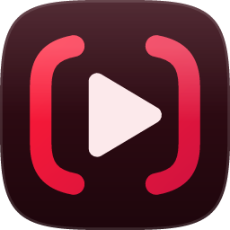

<p align="center">
  
</p>

<h1 align="center">No Distractions for YouTube</h1>

<p align="center">
  A small Chrome extension that hides the parts of YouTube that pull you away from the video you came for.<br>
  Free, open source, no tracking. Not affiliated with YouTube.
</p>

---

## What it hides

Each one has its own switch, and a **Master** On/Off switch turns them all off at once.

| Setting | What disappears |
|---|---|
| **Related videos** | The "Up next" column beside the player. Playlists, live chat and transcripts stay. |
| **Comments** | The comment section below the video. |
| **Shorts shelves** | The rows of Shorts on Home, Search and under videos. |
| **Video description** | The box under the title with views, date and description. |

Sections are hidden before the page finishes drawing, so they don't flash on screen first. Your choices apply to every open YouTube tab right away, and with Chrome sync on they follow you to your other computers.

In the popup, click the arrow next to any setting to see a sketch of exactly which part of the page it hides. There's also a **Light / Dark / System** appearance switch.

## Install

The extension isn't in the Chrome Web Store yet, so you install it from this repository. It takes about a minute.

1. **Download it.** Click the green **Code** button above → **Download ZIP**, then unzip it. (Or `git clone https://github.com/aenimaa/no-distractions-for-youtube.git`.)
2. Open **`chrome://extensions`** in Chrome.
3. Turn on **Developer mode** (top-right corner).
4. Click **Load unpacked** and choose the **`extension`** folder inside the download.
5. Pin it: click the puzzle-piece icon in Chrome's toolbar, then the pin next to **No Distractions for YouTube**.

It works in Chrome 107 or newer, and in other Chromium browsers (Edge, Brave, Opera, Vivaldi) the same way.

### Updating

Download the new version, replace the old folder's contents, then click the **Reload** icon on the extension's card in `chrome://extensions`. Your settings are kept: the extension has a fixed ID, so moving or renaming the folder doesn't reset them either.

## How to use

1. Open any YouTube page.
2. Click the extension's icon.
3. Switch sections on or off. The page updates instantly, without a reload.

All four sections are hidden by default. Set **Master** to **Off** to see YouTube exactly as normal, without losing your individual choices.

## Safety

The extension runs only on `www.youtube.com`, its only permission is saving its own settings, and it makes no network requests. It collects nothing.

- **[SAFETY.md](SAFETY.md)** explains each permission (including Chrome's "Read and change your data on www.youtube.com" warning) and lists four ways to verify these claims yourself.
- **[Safety checker](https://aenimaa.github.io/no-distractions-for-youtube/tools/safety-check.html)** runs in your browser. Pick the extension folder and it scans for red flags (broad permissions, network calls, hidden or remote code) without uploading anything. It works on other unpacked extensions too. The same page is in this repo at [`tools/safety-check.html`](tools/safety-check.html) if you'd rather open it offline.

## Ideas, bugs and questions: please open an issue

This is a young project, and feedback shapes it.

- **Something still shows, or something broke?** YouTube changes its page structure often, so this will happen sometimes. [Report it](https://github.com/aenimaa/no-distractions-for-youtube/issues/new?template=bug_report.yml). The form asks for the page and, if you can, the element's HTML (right-click → Inspect → Copy element), which usually makes the fix quick.
- **Want something else hidden, or a new feature?** [Suggest it](https://github.com/aenimaa/no-distractions-for-youtube/issues/new?template=feature_request.yml). Big or small, all ideas are welcome.
- **Just have a question?** [Open a blank issue](https://github.com/aenimaa/no-distractions-for-youtube/issues/new).

Pull requests are welcome too. For anything larger than a small fix, opening an issue first helps agree on the approach.

## Project structure

```
extension/           The extension itself: the folder you load in Chrome
  hide.css           Rules that hide each section (hidden by default)
  content.js         Turns rules off for the sections you've switched off
  settings.js        Loads and saves settings
  popup.*            The popup window
  theme-init.js      Applies the popup's Light/Dark choice before it draws
  fonts/             Asap typeface, bundled so nothing loads from the web
tools/
  safety-check.html  Standalone safety checker
docs/                Images for this README
SAFETY.md            Permissions, privacy policy, how to verify
```

## Credits

Vibe-coded by Nima Sh. Released under the [MIT License](LICENSE).

The popup uses [Asap](https://github.com/Omnibus-Type/Asap) by Omnibus-Type, licensed under the [SIL Open Font License](extension/fonts/OFL.txt).

YouTube is a trademark of Google LLC. This project is independent and not endorsed by or affiliated with Google or YouTube.
