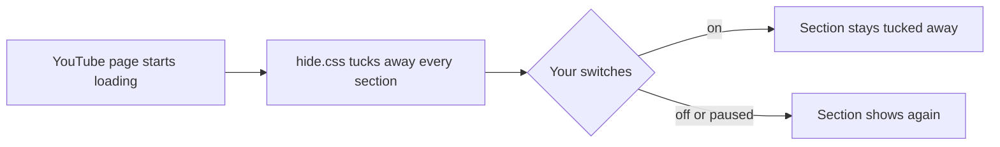

<p align="center">
  <b>English</b> · <a href="README.fa.md">فارسی</a>
</p>

<p align="center">
  
</p>

<h1 align="center">Focus Mode for YouTube</h1>

<p align="center">
  Tuck away what pulls you from the video you came for.<br>
  <sub>Free · open source · no tracking · not affiliated with YouTube</sub>
</p>

<p align="center">
  <a href="https://github.com/aenimaa/focus-mode-for-youtube/releases/latest/download/focus-mode-for-youtube.zip"><b>⬇️ Download the latest version</b></a><br>
  <sub>For Chrome and other Chromium browsers · <a href="https://aenimaa.github.io/focus-mode-for-youtube/">Website</a></sub><br>
  <a href="https://addons.mozilla.org/firefox/addon/focus-mode-for-youtube/"></a>
</p>

<p align="center">
  <picture>
    <source media="(prefers-color-scheme: dark)" srcset="docs/illustrations/hero-dark.svg">
    
  </picture>
</p>

---

## 🚀 Install in a minute

🦊 **On Firefox?** [Add it from Firefox Add-ons](https://addons.mozilla.org/firefox/addon/focus-mode-for-youtube/) in one click, and it updates by itself. The steps below are for Chrome and other Chromium browsers.

1. **Unzip** the download.
2. Open `chrome://extensions` and turn on **Developer mode** (top right).
3. Click **Load unpacked** and choose the unzipped folder.

📌 Then click the puzzle-piece icon in Chrome's toolbar and pin **Focus Mode for YouTube**.

## 🙈 What it tucks away

Each part has its own switch. Everything starts tucked away, and you can bring back anything you miss.

### On the video page

#### Related videos

The "Up next" column beside the player. The video moves to the center; playlists, live chat and transcripts stay.

<picture>
  <source media="(prefers-color-scheme: dark)" srcset="docs/illustrations/related-dark.svg">
  
</picture>

#### End screen

The cards and suggestion grid that appear as a video ends. Autoplay's countdown stays visible.

<picture>
  <source media="(prefers-color-scheme: dark)" srcset="docs/illustrations/endscreen-dark.svg">
  
</picture>

#### Comments

The comments under the video.

<picture>
  <source media="(prefers-color-scheme: dark)" srcset="docs/illustrations/comments-dark.svg">
  
</picture>

#### Description

The box under the title, with views, date and description.

<picture>
  <source media="(prefers-color-scheme: dark)" srcset="docs/illustrations/description-dark.svg">
  
</picture>

### On Home

#### Shorts

Shorts rows, single Shorts in search and under videos, and the Shorts entry in the menu.

<picture>
  <source media="(prefers-color-scheme: dark)" srcset="docs/illustrations/shorts-dark.svg">
  
</picture>

#### Explore

The Explore section of the left menu, and Home's "Explore more topics" row.

<picture>
  <source media="(prefers-color-scheme: dark)" srcset="docs/illustrations/explore-dark.svg">
  
</picture>

## 🎛️ Controls

**⏸️ Pause when you want YouTube as usual.** The Master switch has three settings: On, Pause and Off. Pause for 15 minutes, 1 hour or until tomorrow morning. It comes back by itself.

**🫧 A quiet corner badge.** A small badge in the bottom-left corner of YouTube shows what's tucked away, with a button to pause for 15 minutes. It stays dim until you hover it and shows itself once a day. Close it with ✕ and you get a few seconds to **Undo**. You can also switch it off in the popup.

<p align="center">
  <picture>
    <source media="(prefers-color-scheme: dark)" srcset="docs/screenshots/badge-dark.png">
    
  </picture>
</p>

**🗺️ A popup with a map.** Three tabs:

- **Focus:** a small map of the Video page and of Home. Tap a tile, or the area itself on the map, to tuck it away or bring it back.
- **Settings:** the popup's look (Light, Dark or System), and the corner badge.
- **About:** how it keeps you safe, and where to report a problem.

<p align="center">
  <picture>
    <source media="(prefers-color-scheme: dark)" srcset="docs/screenshots/popup-dark.png">
    
  </picture>
</p>

## 🔒 Safe by design

Runs only on youtube.com. Its only permission is saving its own settings. No network requests, no tracking, nothing collected.
[How to verify it yourself →](SAFETY.md) · [Online safety checker →](https://aenimaa.github.io/focus-mode-for-youtube/tools/safety-check.html)

Curious how that compares? See [how much access different kinds of extensions need →](SAFETY.md#how-much-access-does-an-extension-need)

## 🙋 Something broken? Got an idea?

YouTube changes its page often, so reports keep this working.

🐞 **[Report a problem](https://github.com/aenimaa/focus-mode-for-youtube/issues/new?template=bug_report.yml)** &nbsp;·&nbsp; 💡 **[Suggest a feature](https://github.com/aenimaa/focus-mode-for-youtube/issues/new?template=feature_request.yml)**

---

## 📚 More

👇 *Click a topic to open it.*

<details>
<summary><b>🔄 Updating to a new version</b></summary>
<br>

Download the new zip, unzip it over your old folder, and click **Reload** on the extension's card in `chrome://extensions`. Your settings stay, even if you move or rename the folder.

</details>

<details>
<summary><b>🌐 Other browsers</b></summary>
<br>

🦊 **Firefox 140+:** install it from [Firefox Add-ons](https://addons.mozilla.org/firefox/addon/focus-mode-for-youtube/). It updates by itself.

Works in Chrome 107+ and other Chromium browsers: Edge, Brave, Opera and Vivaldi. Their extensions page has the same **Developer mode** and **Load unpacked** options.

</details>

<details>
<summary><b>⚙️ How it works</b></summary>
<br>

The hiding rules are plain CSS, applied before YouTube draws the page, so nothing flashes on screen first. Changes reach every open YouTube tab instantly. With Chrome sync or Firefox Sync on, your choices follow you to your other computers.



```
extension/           The extension: what's in the download
  hide.css           Rules that tuck away each section
  content.js         Turns rules off for sections you've switched off
  badge.js           The quiet corner badge
  settings.js        Loads and saves settings
  popup.*            The popup window
  fonts/             Asap typeface, bundled so nothing loads from the web
tools/
  safety-check.html  The safety checker
```

</details>

<details>
<summary><b>🤝 Contributing</b></summary>
<br>

Pull requests are welcome. To run the tests, install [Node.js](https://nodejs.org) and run `npm install`, then `npm test`. For anything bigger than a small fix, please open an issue first so we can agree on the approach. New releases are built automatically when a version tag (like `v3.0.0`) is pushed.

</details>

<details>
<summary><b>📄 Credits and license</b></summary>
<br>

Vibe-coded by Nima Sh, who gets distracted too. [MIT License](LICENSE).
Font: [Asap](https://github.com/Omnibus-Type/Asap) by Omnibus-Type, [SIL Open Font License](extension/fonts/OFL.txt).
YouTube is a trademark of Google LLC. This project isn't endorsed by or affiliated with Google or YouTube.

</details>
